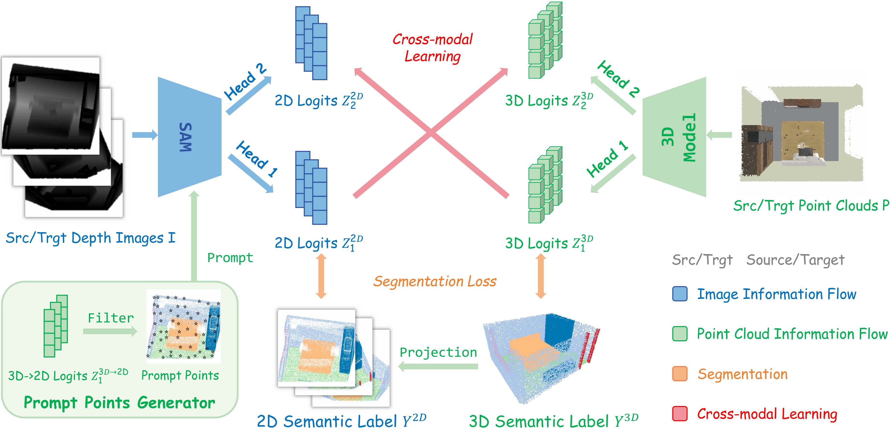

# Unsupervised Domain Adaptation for 3D Indoor Semantic Segmentation via Boundary-Aware Cross-Modal Learning

We propose an unsupervised learning approach for 3D indoor semantic segmentation
<div align="center">
    
</div>

## 1.Environment
Install the dependent libraries as follows
```bash
### cuda-11.1
conda create -n bacm python=3.7
conda activate bacm

pip install torch==1.8.0 torchvision==0.9.0
pip install opencv-python tensorboardX SharedArray addict easydict spconv-cu113 einops
pip install numpy --upgrade
conda install -c open3d-admin open3d

cd lib/pointgroup_ops
pip install . 
cd ../pointops
pip install .
```
<!-- ### torch_scatter -->
Install [torch_scatter](https://data.pyg.org/whl/torch-1.8.0%2Bcu111/torch_scatter-2.0.7-cp37-cp37m-linux_x86_64.whl)
```
pip install torch_scatter-2.0.7-cp37-cp37m-linux_x86_64.whl
```

## 2.Data Preparation

### 3D-FRONT Dataset
Please download the subsampled and pre-processed [3D-FRONT dataset](https://connecthkuhk-my.sharepoint.com/:u:/g/personal/u3007346_connect_hku_hk/ETXTrSJmy8lLikn0I_zsOisB5utQnffuqp3dGYwv-IIzDw?e=tpHJqc) and organize it as follows.
```
BACM
├── data
│   ├── 3dfront
│   │   │── density1250
|   |   |   |——00110bde-f580-40be-b8bb-88715b338a2a_Bedroom-43072.npy
|   |   |   |——...
├── cfgs
├── dataset
```

### ScanNet Dataset
<!-- scannet processed data -->
Please download the [ScanNet Dataset](http://www.scan-net.org/) and follow [PointGroup](https://github.com/dvlab-research/PointGroup/blob/master/dataset/scannetv2/prepare_data_inst.py) to pre-process the dataset as follows. Note that we change the ignore label index from ```-100``` to ```255```.
```
BACM
├── data
│   ├── scannetv2
│   │   │── train_group
│   │   │   │── scene0000_00.pth
│   │   │   │── ...
│   │   │── val_group
├── cfgs
├── dataset
```

### S3DIS Dataset
Please download the [S3DIS Dataset](http://buildingparser.stanford.edu/dataset.html#Download) and follow [PointNet](https://github.com/charlesq34/pointnet/blob/master/sem_seg/collect_indoor3d_data.py) to pre-process the dataset as follows or directly download the pre-processed data [here](https://connecthkuhk-my.sharepoint.com/:u:/g/personal/u3007346_connect_hku_hk/Ed4LYh7wwp1CkVp4OfpfAocBvVy52EPO4CtK0vSmKR3E6w?e=fgNfXl).
```
BACM
├── data
│   ├── s3dis
│   │   │── trainval_fullarea
│   │   │   │── Area_1_Conference_1.npy
│   │   │   │── ...
├── cfgs
├── dataset
```

## 3.Pretrain and Self-train
Please download [SAM checkpoint](https://dl.fbaipublicfiles.com/segment_anything/sam_vit_b_01ec64.pth) and organize it as follows.
```
BACM
|——pretrained_model
|  |——sam_vit_b_01ec64.pth
```

### pretrain
```
python3 -m torch.distributed.launch --nproc_per_node=${NUM_GPUS} main.py --src_dataset ${src} --trgt_dataset ${trgt} --sam_path ${pretrained sam model path}
```

For instance, if you want to train the pretrained model for 3D-FRONT→ScanNet with 4 GPUs:
```
python3 -m torch.distributed.launch --nproc_per_node=4 main.py --src_dataset front3d --trgt_dataset scannet --sam_path ../pretrained_model/sam_vit_b_01ec64.pth
```

### self-train

```
python3 -m torch.distributed.launch --nproc_per_node=${NUM_GPUS} main_st.py --src_dataset ${src} --trgt_dataset ${trgt} --sam_path ${pretrained sam model path} --weight_pc ${pc weight path} --weight_img ${img weight path}
```

For instance, if you want to train the model for 3D-FRONT→ScanNet with 4 GPUs:
```
python3 -m torch.distributed.launch --nproc_per_node=4 main_st.py --src_dataset front3d --trgt_dataset scannet --sam_path ../pretrained_model/sam_vit_b_01ec64.pth --weight_pc '../output/da_front3d_scannet/spconv/default/ckpt/pc_train_epoch_70.pth' --weight_img '../output/da_front3d_scannet/spconv/default/ckpt/img_train_epoch_70.pth'
```
 

## Acknowledgments
Our code base is partially borrowed from [DODA](https://github.com/CVMI-Lab/DODA) and [GSAM](https://github.com/usagisukisuki/G-SAM).
